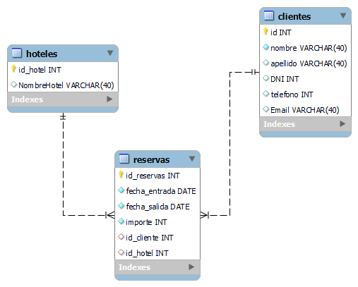

# Proyecto 4 API buscador para reservas de hotel de una Agencia de Viajes. (myronhotel).

Geekshubs Academy: FULL STACK DEVELOPER proyectyo realizado por [Ronny Rojas M.](mailto:ronny3030@gmail.com)

### DEMO

https://myronhotel-production.up.railway.app/


## Descripcion


Sera un buscador que permita a cualquier personal de atencion al cliente de una agencias de viajes buscar reservas por diferentes campos y encontrar fácilmente una reserva en concreto o bien el histórico de reservas de un cliente.

El buscador desarrollado permite buscar por cualquiera de estos campos:

* Id de la reserva
* Nombre del cliente
* DNI del cliente
* Teléfono del cliente
* Email del cliente
* Hotel donde se aloja
* Fecha de entrada al hotel
* Fecha de salida del hotel

## Diagrama



## End points

#####CLIENTES

| Metodo  | ruta | descripcion|
| ------------- | ------------- | ------------- |
| Get | /clientes  | lista de clientes  |
| Get  | /clientes/:id  | cliente por id  |
| Get | /clientes/name/:nombre   | cliente por nombre  |
| Get  | /clientes/DNI/:DNI   |  cliente por DNI |
| Get | /clientes/phone/:telefono  | clientes por telefono  |
| Get | /clientes/email/:Email  | clientes por Email  |
| Get | /clientes/:id/reservas  | buscar por id cliente historial de reservas  |
| Get | /clientes/:id/reservas/hoteles  | busca id cliente historial de hoteles  |


<!-- * GET lista clientes.
/clientes

* GET cliente por id.
/clientes/:id

* GET cliente por nombre.
/clientes/name/:nombre

* GET DNI
/clientes/DNI/:DNI

* GET telefono
/clientes/phone/telefono

* GET email
/clientes/email/Email

* GET buscar por id cliente toda sus reservas
/clientes/:id/reservas

* GET busca id clientes su historial de hoteles
/clientes/:id/reservas/hoteles -->

#####RESERVAS

| Metodo  | ruta | descripcion|
| ------------- | ------------- | ------------- |
| Get | /reservas  | lista de reservas  |
| Get  | /reservas/:id  | reserva por id  |
| Get | /reservas/checkin/:fecha_entrada   | reserva por fecha checkin  |
| Get  | /clientes/checkout/:fecha_salida   | reserva por fecha checkout |

<!-- * GET lista reservas
/reservas

* GET reserva por id.
/reservas/id

* GET fecha de entrada
/reservas/checkin/fecha_entrada

* GET fecha de salida
/reservas/checkout/fecha_salida -->

#####HOTELES

| Metodo  | ruta | descripcion|
| ------------- | ------------- | ------------- |
| Get | /hoteles  | lista de hoteles  |
| Get  | /hoteles/:id  | hotel por id  |

<!-- * GET lista hoteles 
/hoteles/

* GET hotel por id.
/hoteles/id -->

### Tecnologias utilizadas

* El diseño de la API se realizo utilizando Express.
* Node.
* Se Utilizo Sequelize ORM.
* BBDD implementada en Mysql.
<!-- * Se incluyeron seeders. -->
### Instalación 

```
npm install
```

### Uso

```
npm run dev
```
comando para ejecutar en desarrollo, luego navegar a http//localhost:3000.


